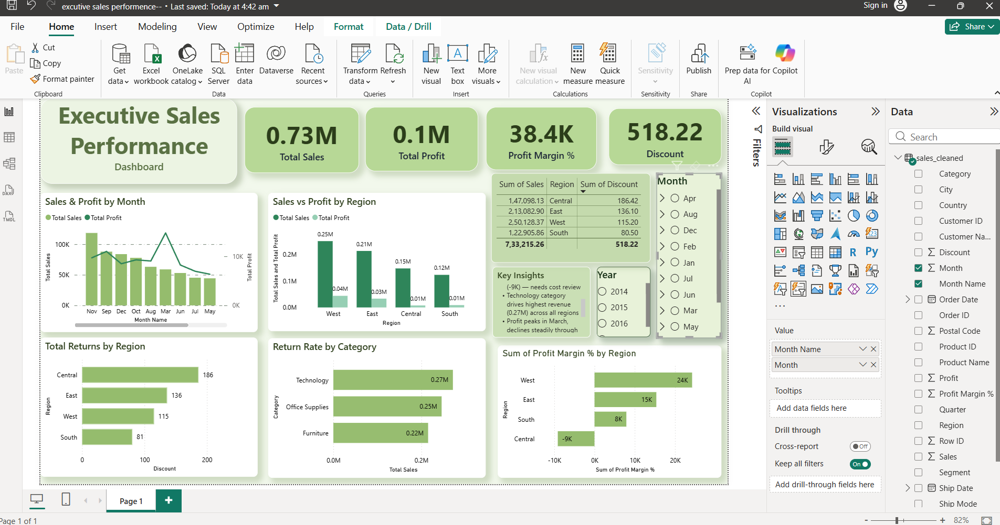

# Sales Performance Analytics Dashboard

End-to-end data analytics project using Python, SQL, and Power BI.

## Tools Used
- Python (pandas) — Data Cleaning
- MySQL — Data Storage & SQL Analysis  
- Power BI — Interactive Dashboard

## Dashboard Preview

## Key Insights
- West region leads in Sales & Profit
- Central region has negative profit margin
- Technology drives highest revenue
- Profit peaks in March